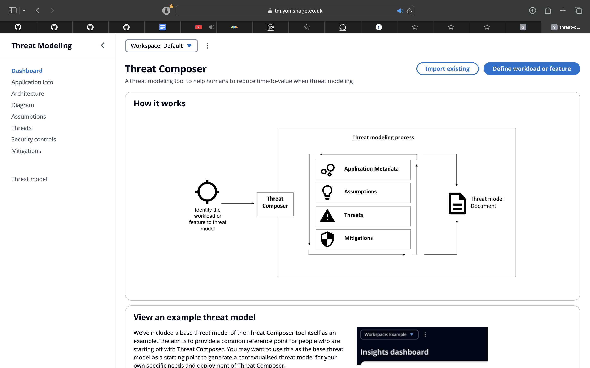
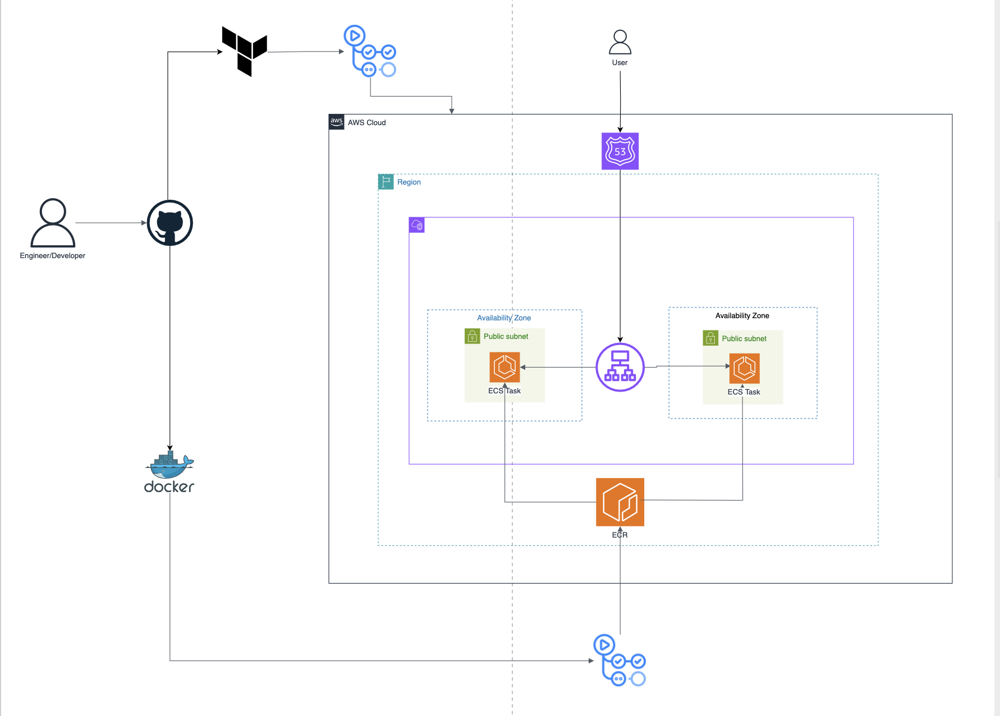

# 🚀 ECS SecOps Deployment

This project deploys the **Threat Composer** application to **AWS ECS Fargate** using **Terraform** and **GitHub Actions* running under a **custom domain** with **SSL setup**, providing a fully automated, repeatable and console-free deployment experience.  

Security is integrated throughout the pipeline by using **GitHub OIDC with fine-grained IAM roles** instead of static credentials, **HashiCorp Vault** for managing sensitive secrets, and **policy-as-code** with tools like **OPA/Conftest** and **Terraform scanners** (TFLint, Trivy, Semgrep) to enforce secure configurations early (**shift-left**). ECS tasks are provisioned with least-privilege IAM roles and infrastructure security policies are validated continuously, ensuring both automation and security are first-class citizens in the deployment.  

---

## 🧱 Key Components

- **Docker**:
  `app/Dockerfile` defines the container image for the application.

- **Terraform Modules**:
  Infrastructure as Code is split into reusable modules:

  - `VPC`
  - `ALB`
  - `ECS`
  - `Route53`

- **CI/CD Pipelines (GitHub Actions)**:
  Automates all infrastructure and deployment tasks:
  - Docker image build & push to ECR
  - Terraform plan & apply
  - Terraform destroy

---

## Working Image



## Architecture Diagram



## 📁 Directory Structure

```sh
.
├── .github
│   └── workflows
│       ├── ci-cd.yml
|       ├── pre-commit.yml
│       ├── terraform-deploy.yml
│       └── terraform-destroy.yml
├── app
│   └── Dockerfile
├── images
├── terraform
│   ├── backend.tf
│   ├── main.tf
│   └── modules
|       ├── ALB
│       └── IAM
│       ├── ECS
│       ├─ Route53
│       └── VPC
│       


```

---
---

## 📦 Deployment Workflow

1. **Docker Build & Push to ECR**

   - Builds the Docker image.
   - Pushes the image to Amazon ECR.

2. **Terraform Deploy**

   - Initializes, plans, and applies the Terraform configuration.
   - Provisions all AWS resources required for the application.
   - Enforces security policies via policy-as-code (OPA/Conftest, Trivy, TFLint).

3. **Terraform Destroy**
   - Destroys all provisioned AWS infrastructure.

---

## ☁️ AWS Infrastructure

- **VPC**: Network isolation and routing.
- **ALB (Application Load Balancer)**: Routes external traffic to ECS service.
- **ECS (Fargate)**: Hosts the Dockerized application.
- **ECR**: Stores the built Docker image.
- **Security Groups**: Firewall rules for networking security.
- **Route 53**: Manages DNS records for custom domain routing.
- **ACM (AWS Certificate Manager)**: Issues SSL/TLS certificates.
- **IAM**: Secures access to AWS resources with least-privilege roles and GitHub OIDC.
- **Vault**: Manages sensitive secrets instead of GitHub Actions secrets.
- **Internet Gateway**: Enables internet access for NAT and public endpoints.

---

## ✅ Goals

- Fully automated and repeatable infrastructure setup.
- No manual steps in AWS console.
- Scalable and production-ready deployment pipeline.
- Security-first design:
  - **OIDC with IAM roles** (no static AWS credentials).
  - **HashiCorp Vault** for secret management.
  - **Policy-as-code** validation (OPA, Conftest).
  - **Continuous security scanning** (Trivy, TFLint, Semgrep).
  - **Least-privilege IAM policies** applied across services.

---

[def]: ./images/working-image.png
