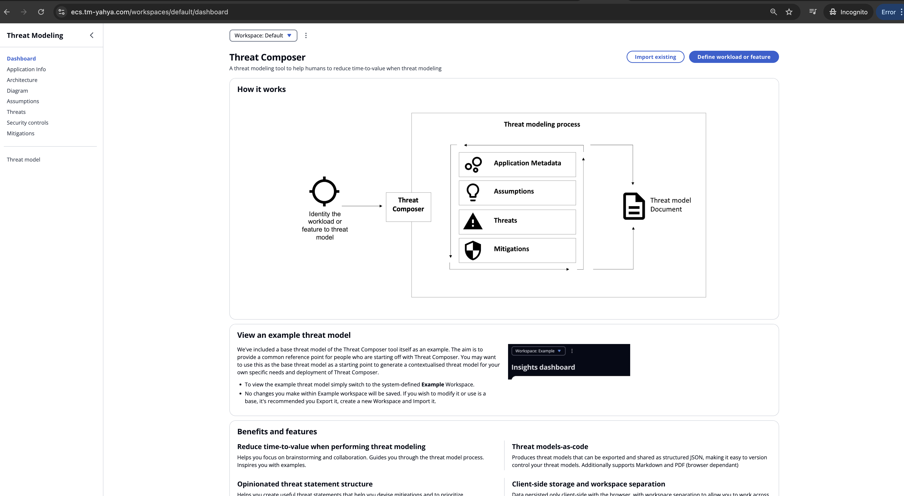

# 🚀 Threat Composer ECS Project

This project deploys the **Threat Composer** application to **AWS ECS Fargate** using **Terraform** and **GitHub Actions**, providing a fully automated, repeatable, and console-free deployment experience.

---

## 🧱 Key Components

- **Docker**:  
  `app/Dockerfile` defines the container image for the application.

- **Terraform Modules**:  
  Infrastructure as Code is split into reusable modules:
  - `VPC`
  - `ALB`
  - `ECS`
  - `Route53`

- **CI/CD Pipelines (GitHub Actions)**:  
  Automates all infrastructure and deployment tasks:
  - Docker image build & push to ECR
  - Terraform plan & apply
  - Terraform destroy

---

## Working Image

## 📁 Directory Structure
.
├── .github
│   └── workflows
│       ├── ci-cd.yml
│       ├── terraform-deploy.yml
│       └── terraform-destroy.yml
├── app
│   └── Dockerfile
├── images
├── terraform
│   ├── backend.tf
│   ├── main.tf
│   └── modules
│       ├── ALB
│       ├── ECS
│       ├── Route53
│       └── VPC

---

## 📦 Deployment Workflow

1. **Docker Build & Push to ECR**
   - Builds the Docker image.
   - Pushes the image to Amazon ECR.

2. **Terraform Deploy**
   - Initializes, plans, and applies the Terraform configuration.
   - Provisions all AWS resources required for the application.

3. **Terraform Destroy**
   - Destroys all provisioned AWS infrastructure.

---

## ☁️ AWS Infrastructure

- **VPC**: Network isolation and routing.
- **ALB (Application Load Balancer)**: Routes external traffic to ECS service.
- **ECS (Fargate)**: Hosts the Dockerized application.
- **ECR**: Stores the built Docker image.
- **Security Groups**: Firewall rules for networking security.
- **Route 53**: Manages DNS records for custom domain routing.
- **ACM (AWS Certificate Manager)**: Issues SSL/TLS certificates.
- **IAM**: Secures access to AWS resources.
- **Internet Gateway**: Enables internet access for NAT and public endpoints.

---

## ✅ Goals

- Fully automated and repeatable infrastructure setup.
- No manual steps in AWS console.
- Scalable and production-ready deployment pipeline.

[def]: ./images/working-image.png